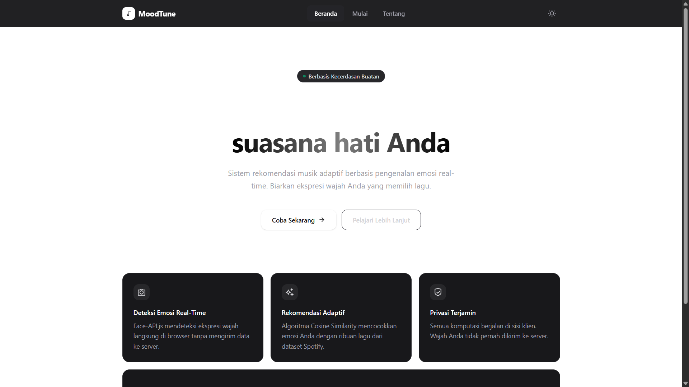
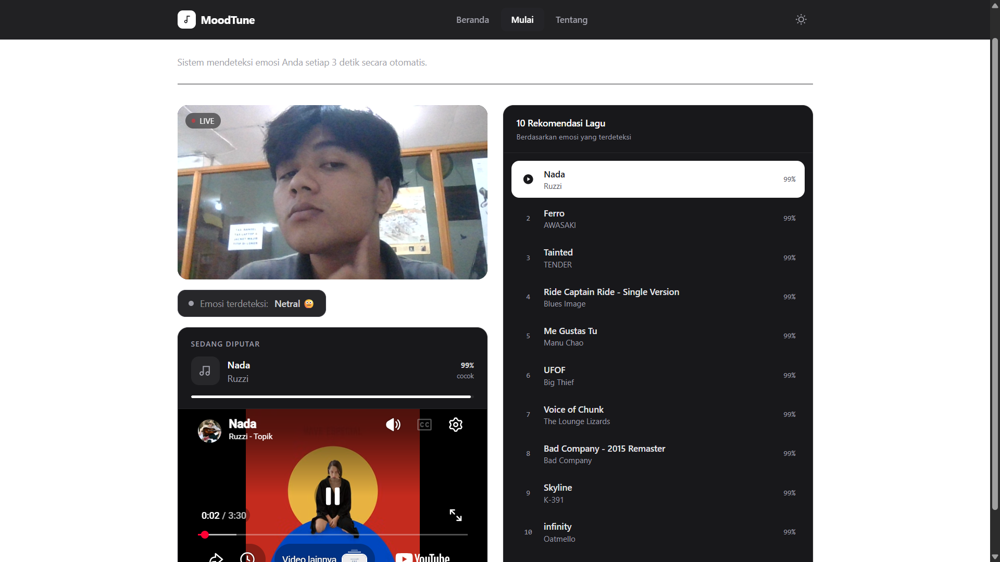
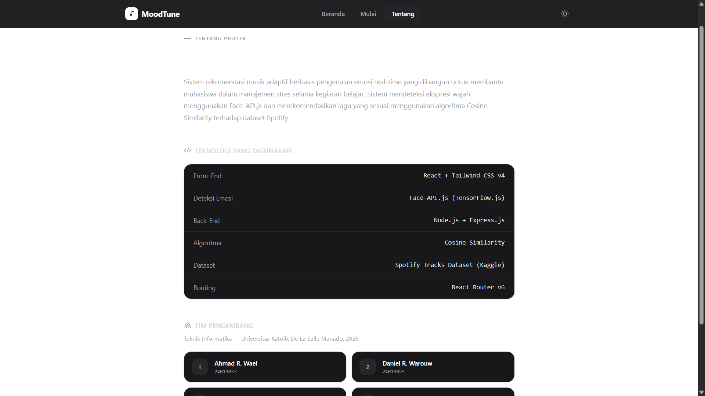

<div align="center">


# MoodTune

**Sistem rekomendasi musik adaptif berbasis pengenalan emosi real-time**

[](https://react.dev/)
[](https://tailwindcss.com/)
[](https://github.com/justadudewhohacks/face-api.js)
[](https://nodejs.org/)
[](LICENSE)

</div>

---

## Tentang Proyek

**MoodTune** adalah sistem rekomendasi musik adaptif yang mendeteksi emosi pengguna secara real-time melalui kamera, lalu merekomendasikan lagu yang sesuai dengan suasana hati tersebut.

Proyek ini dibangun sebagai karya akhir mahasiswa **Program Studi Teknik Informatika, Fakultas Teknik, Universitas Katolik De La Salle Manado** (2026) dengan tujuan membantu mahasiswa dalam manajemen stres selama kegiatan belajar.

Seluruh proses deteksi wajah berjalan **langsung di browser pengguna** tanpa mengirimkan data ke server, sehingga privasi pengguna tetap terjaga.

---

## Tampilan Aplikasi

### Halaman Beranda



---

### Halaman Deteksi Emosi (App)



---

### Halaman Tentang



---

## Fitur Utama

- 🎭 **Deteksi Emosi Real-Time** — Mendeteksi 7 ekspresi wajah (senang, sedih, marah, takut, jijik, terkejut, netral) menggunakan Face-API.js setiap 3 detik.
- 🎵 **Rekomendasi Adaptif** — Algoritma Cosine Similarity mencocokkan profil emosi dengan atribut lagu dari dataset Spotify (valence, energy, danceability, dsb).
- 🔒 **Privasi Terjamin** — Semua komputasi berjalan di sisi klien; wajah pengguna tidak pernah dikirim ke server.
- ▶️ **Pemutar Terintegrasi** — Memutar preview lagu via YouTube embed langsung di dalam aplikasi.
- 🌙 **Dark / Light Mode** — Mendukung tema gelap dan terang.

---

## Teknologi yang Digunakan

| Layer | Teknologi |
|---|---|
| Front-End | React 18 + Tailwind CSS v4 |
| Deteksi Emosi | Face-API.js (TensorFlow.js) |
| Back-End | Node.js + Express.js |
| Algoritma | Cosine Similarity |
| Dataset | Spotify Tracks Dataset (Kaggle) |
| Routing | React Router v6 |
| Icons | React Icons |

---

## Arsitektur Sistem

```
┌─────────────────────────────────────────────────────┐
│                    Browser (Client)                  │
│                                                     │
│  ┌─────────────┐    ┌──────────────┐               │
│  │  Webcam /   │───▶│  Face-API.js │               │
│  │  CameraView │    │  (TF.js)     │               │
│  └─────────────┘    └──────┬───────┘               │
│                            │ Deteksi Emosi          │
│                            ▼                        │
│                    ┌──────────────┐                 │
│                    │  AppPage     │                 │
│                    │  (React)     │                 │
│                    └──────┬───────┘                 │
│                           │ HTTP Request            │
└───────────────────────────┼─────────────────────────┘
                            │
┌───────────────────────────▼─────────────────────────┐
│                  Node.js + Express                   │
│                                                     │
│   /recommendations?emotion=happy                    │
│           │                                         │
│           ▼                                         │
│   Cosine Similarity ──▶ Spotify Dataset (CSV)       │
│           │                                         │
│           ▼                                         │
│   Top 10 Lagu (JSON)                                │
│                                                     │
│   /youtube-id?q=...  ──▶  YouTube Data API          │
└─────────────────────────────────────────────────────┘
```

---

## Cara Menjalankan

### Prasyarat

- Node.js >= 18
- npm >= 9

### 1. Clone Repository

```bash
git clone https://github.com/username/moodtune.git
cd moodtune
```

### 2. Install Dependensi

```bash
# Front-end
cd client
npm install

# Back-end
cd ../server
npm install
```

### 3. Konfigurasi Environment

Buat file `.env` di folder `server/`:

```env
PORT=5000
YOUTUBE_API_KEY=your_youtube_api_key_here
```

### 4. Jalankan Aplikasi

```bash
# Jalankan back-end (dari folder server/)
npm run dev

# Jalankan front-end (dari folder client/, terminal baru)
npm run dev
```

Aplikasi akan berjalan di `http://localhost:5173`.

> **Catatan:** Izinkan akses kamera di browser saat diminta agar deteksi emosi dapat berjalan.

---

## Struktur Folder

```
moodtune/
├── client/                  # Front-end React
│   ├── public/
│   ├── src/
│   │   ├── components/
│   │   │   ├── CameraView.jsx
│   │   │   ├── EmotionBadge.jsx
│   │   │   ├── Player.jsx
│   │   │   ├── SongList.jsx
│   │   │   └── Navbar.jsx
│   │   ├── pages/
│   │   │   ├── LandingPage.jsx
│   │   │   ├── AppPage.jsx
│   │   │   └── AboutPage.jsx
│   │   ├── hook/
│   │   │   └── useEmotionDetector.js
│   │   ├── services/
│   │   │   └── api.js
│   │   └── context/
│   │       └── ThemeContext.jsx
│   └── package.json
│
├── server/                  # Back-end Express
│   ├── routes/
│   │   ├── recommendations.js
│   │   └── youtube.js
│   ├── data/
│   │   └── spotify_tracks.csv
│   ├── index.js
│   └── package.json
│
├── docs/
│   └── screenshots/         # ← Taruh screenshot di sini
│       ├── landing-page.png
│       ├── app-page.png
│       └── about-page.png
│
└── README.md
```

---

## Tim Pengembang

Dikembangkan oleh mahasiswa **Teknik Informatika — Universitas Katolik De La Salle Manado, 2026**.

| No | Nama | NIM |
|:---:|---|:---:|
| 1 | Ahmad R. Wael | 24013033 |
| 2 | Daniel R. Warouw | 24013025 |
| 3 | Kevin L. Sondakh | 24013023 |
| 4 | Maltrian J. Rondonuwu | 24013067 |
| 5 | Andriano Darinding | 24013011 |
| 6 | Matthew Z. Kaawoan | 24013068 |

---

<div align="center">


</div>
